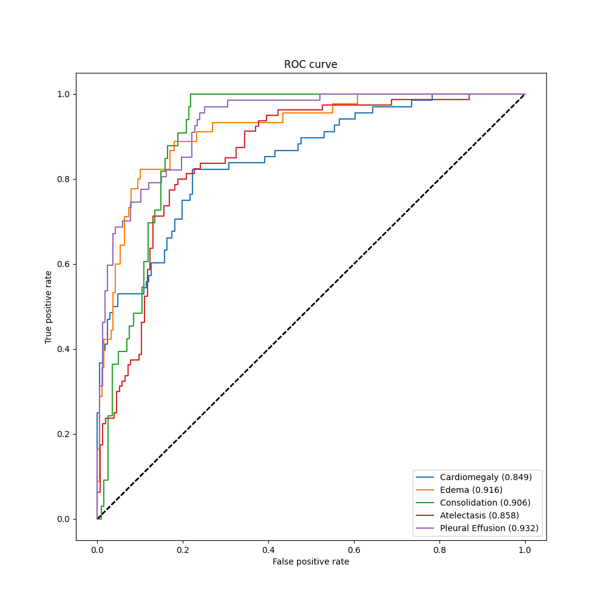

# AI-Chexpert
This project contains the basic tools for training multilabel, medical neural networks. All settings (established according to available articles) and 
results are just a demo showing the performance for the simplest analysis case. The project includes a template matching algorithm, which significantly 
reduces the number of captions and aligns the images. 

The main research area of this project focuses on the analysis of available data and its exploitation (various LSR techniques, exploitation of correlations, 
conditional learning). The final release includes numerous custom implementations such as LSRs etc.

U_ones_LSR:

U_zeros_base:

